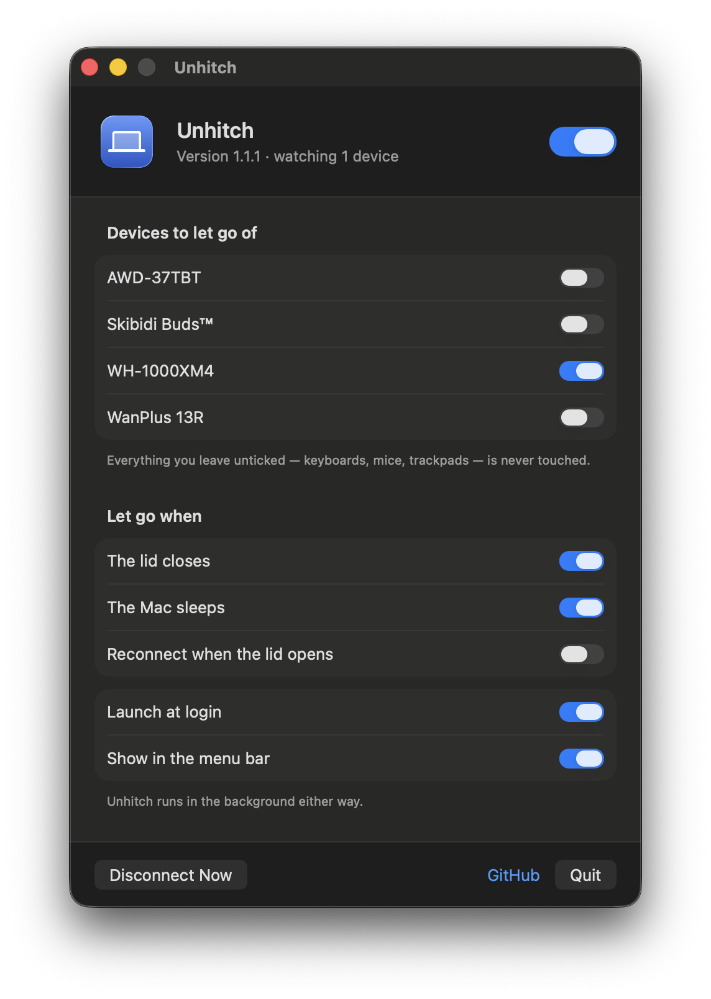

<p align="center">
  
</p>

<h1 align="center">Unhitch</h1>

<p align="center">
  <b>Your MacBook is using one of your headphones' two Bluetooth slots to do nothing.</b>
</p>

<p align="center">
  <a href="https://github.com/Zawaer/unhitch/actions/workflows/build.yml"></a>
  
  
  <a href="LICENSE"></a>
</p>

<br>

Multipoint is not unlimited. It is almost always exactly two connections. So when you
shut the lid and walk off, the Mac in your bag does not politely step aside — it keeps
its slot. You are down to one, to be shared between your phone, your tablet and your
work laptop, and something has to lose.

Sometimes it loses loudly: a call routed to a laptop that is closed inside a bag,
playback that stutters when you hit play on your phone, a headset that flatly refuses
to switch. More often it loses quietly. Your headphones connect to the wrong thing
slightly too often, and you never work out why.

On a Sony WH-1000XM4 the bill is itemised for you. Multipoint and LDAC are mutually
exclusive — you may have two slots, or you may have the good codec, not both. Spending
one of those hard-bought slots on a sleeping laptop is a bad deal in anyone's money.

Unhitch takes the slot back.

<br>

## Why not just turn Bluetooth off on sleep?

Because that also switches off **Find My's offline finding network** — the thing that
lets a closed, sleeping Mac be located by other Apple devices passing within Bluetooth
range. Turning the radio off to stop one headset reconnecting means giving up the
ability to find a stolen laptop, and taking your keyboard and trackpad down with it.

Unhitch closes individual device links instead. The radio is never touched, so offline
finding keeps broadcasting exactly as before. This is the entire reason the app exists
rather than a two-line `blueutil` script.

<br>

## Is this you?

Ranked by how much it actually costs you:

- **You dock to an external display.** The lid is shut but the Mac is wide awake, and
  audio keeps routing to a laptop closed on a stand. Not an occasional glitch — this is
  every working day.
- **You have more than two devices.** Phone, tablet, work laptop, personal Mac. Two
  slots. The sleeping laptop is the least deserving occupant of one of them.
- **Your headphones do not do multipoint at all.** The pain is rarer but total: calls
  and audio land on a machine you are not near.
- **You use AirPods.** Partially. Automatic switching hands your podcast to a closed
  MacBook; dropping the link removes the Mac as a switching target. Apple's own
  *Connect to This Mac → When Last Connected to This Mac* setting covers some of this
  already, so try that first.

**Not you:** one Mac, one phone, one multipoint headset, never docked. You have two
slots and two devices. Don't install this.

<br>

## What it does

- Lists your paired Bluetooth devices. Tick the ones that should let go on lid close.
- Drops those links when you close the lid, when the Mac sleeps, or both.
- Keeps dropping them while the lid stays shut — so earbuds pulled out of their case
  an hour later reconnect to your phone, not to the laptop in your bag.
- Optionally reconnects them when you open the lid again.

Everything else is left alone: your keyboard, your mouse, your trackpad, and the radio
itself.

<p align="center">
  
</p>

<br>

## Set it once and forget it

Unhitch is not something you operate. After the first launch there is nothing to click
again: it watches the lid, the sleep signal and incoming Bluetooth connections, and acts
on its own. The **Disconnect Now** button exists as an escape hatch, not as a routine.

The intended end state is an app you never see — launched at login, menu bar icon
switched off, quietly declining to hold a connection it should not be holding.

<br>

## Install

Download `Unhitch.zip` from [Releases](https://github.com/Zawaer/unhitch/releases),
unzip it, and drag `Unhitch.app` to your Applications folder.

The app is signed locally rather than notarized, so the first launch needs one extra
step: **right-click the app → Open → Open**. macOS remembers the choice and every launch
after that is a normal double-click.

On first launch the window opens by itself and Unhitch adds itself as a login item, so
it survives a restart. Tick your headphones and you are done — there is no account, no
onboarding, and nothing else to configure.

### With Homebrew

```sh
brew tap zawaer/unhitch https://github.com/Zawaer/unhitch
brew trust zawaer/unhitch
brew install --cask zawaer/unhitch/unhitch
```

`brew trust` is required because Homebrew 6 refuses to evaluate code from a third-party
tap until you say so. Updates then arrive with `brew upgrade --cask unhitch`, and
`brew uninstall --zap --cask unhitch` removes the app along with its settings.

Homebrew does **not** avoid the first-launch step above. Removing the quarantine flag
automatically needs a notarized app, so the right-click → Open is still a one-time cost
whichever way you install.

<br>

## Build from source

Requires the Xcode command line tools, nothing else.

```sh
git clone https://github.com/Zawaer/unhitch.git
cd unhitch
make install
```

`make install` builds the app, signs it locally and puts it in `/Applications`.

| Target | What it does |
| --- | --- |
| `make app` | Build `dist/Unhitch.app` without installing |
| `make run` | Build and launch from `dist/` |
| `make zip` | Package `dist/Unhitch.zip` for a release |
| `make cask` | Point `Casks/unhitch.rb` at the latest published release |
| `make icon` | Redraw the app icon from its generator |
| `make uninstall` | Quit and remove the installed app |
| `make log` | Show what Unhitch has decided in the last 15 minutes |
| `make clean` | Remove build products |

<br>

## How it works

Three signals drive the whole app.

**Lid state** comes from `AppleClamshellState` on `IOPMrootDomain`, watched through an
IOKit interest notification. This is tracked separately from sleep on purpose — a
MacBook driving an external display stays wide awake with the lid shut, and that is
exactly when a headset silently re-attaching is most irritating.

**Sleep** comes from `IORegisterForSystemPower` rather than the friendlier
`NSWorkspace.willSleepNotification`, because the low-level API lets the app hold off
acknowledging sleep until the disconnect has actually landed. Acknowledging late is
fine; sleeping with the headset still attached is not.

**Connections** come from `IOBluetoothDevice.register(forConnectNotifications:)`. While
the lid is shut, any watched device that connects gets hung up on immediately. This is
what catches earbuds taken out of their case long after the laptop was put away.

Disconnecting is `IOBluetoothDevice.closeConnection()` — one link, not the radio. It
returns before the link is really gone (about 2.4 seconds on an M3 Air with an A2DP
headset), so the app polls until the device actually reports itself disconnected and
retries if it does not.

<br>

## Checking what it did

Unhitch logs every decision it makes to the unified log, which is the closest thing a
menu bar app has to showing its work:

```sh
log show --predicate 'subsystem == "com.zawaer.unhitch"' --last 15m --style compact
```

Close the lid, wait a moment, open it again, and you should see the lid transitions and
each disconnect land:

```
lid closed
disconnect WH-1000XM4: requested
system will sleep
disconnect WH-1000XM4: done
lid opened
```

From a clone, `make log` is the same thing.

<br>

## Notes and limits

- **Find My is unaffected.** Unhitch never enables, disables, or reconfigures the
  Bluetooth radio. Offline finding keeps broadcasting from a closed, sleeping Mac.
- **Reconnect on lid open is off by default.** If your headphones moved to your phone
  while you were away, having the Mac grab them back the moment you sit down is its own
  small annoyance. Turn it on if you want it.
- **A device can only be dropped while the Mac is running code.** If earbuds connect
  during deep sleep, the Mac has to surface far enough to schedule the app before the
  link is dropped. In practice a connection wakes the machine enough for this; in a very
  deep sleep state the drop happens at the next wake instead.
- **Macs without a lid** (mini, Studio, iMac) hide the lid trigger and use the sleep
  trigger only.

<br>

## License

MIT. See [LICENSE](LICENSE).
